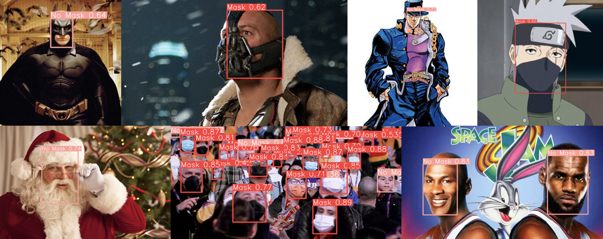
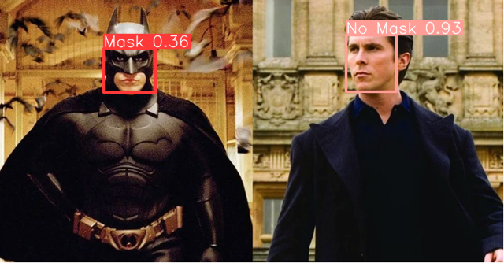
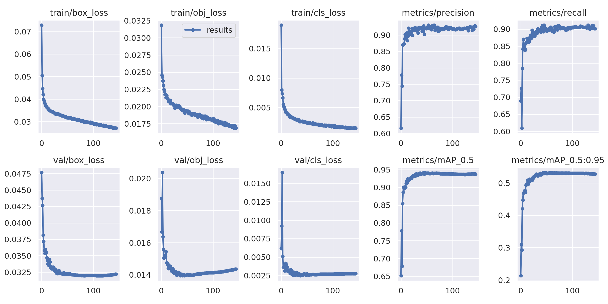
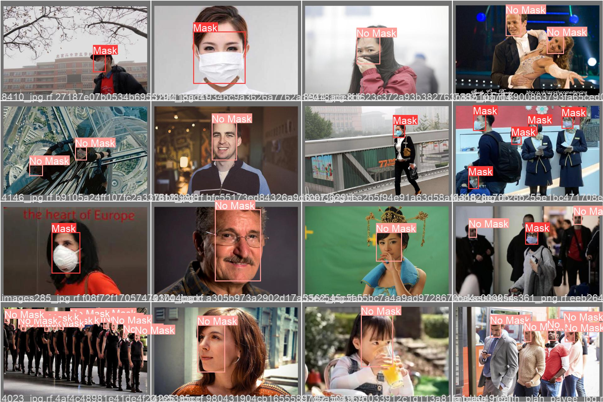
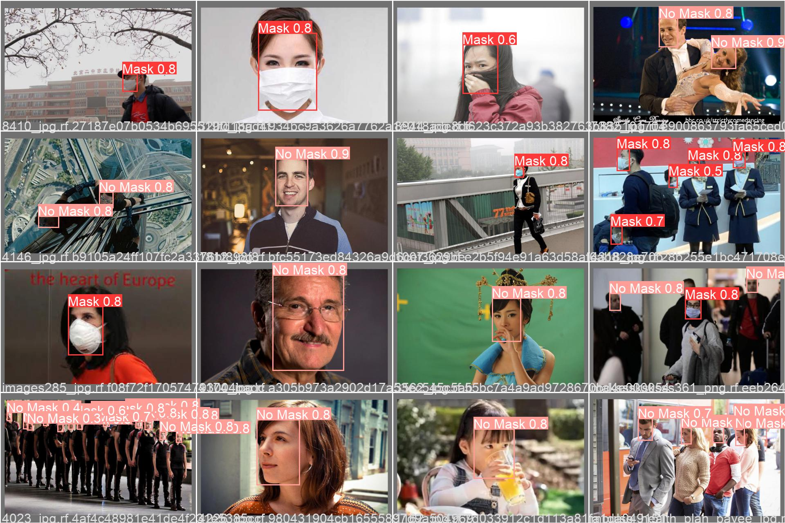

# Are you wearing a mask?

State of the art model for detecting masked and unmasked faces. Try out the [demo](https://huggingface.co/spaces/hlydecker/are-you-wearing-a-mask)!



**Figure 1:** Fast and accurate predictions on images similar to the training dataset, as well as impressive performance on a range of images far outside the domain of the training dataset. This demonstrates that the model has effectively learned what a masked and unmasked face looks like, and is highly adaptable and robust when dealing with novel scenarios.

## Abstract

Real time detection of masked and unmasked faces could be a valuable tool for monitoring and undestanding the transmission of known and yet to be discovered infectious diseases. Advances in deep neural networks and computer hardware have led to the development of numerous computer vision algorithms which are trained on massive general purpose datasets and are able to provide accurate and fast predictions. Using transfer learning, we can apply these general purpose computer vision models to specific problems, such as detecting masked and unmasked faces. I fine tuned a state of the art pretrained object detection model on a new composite dataset, producing what is now the state of the art object detection model for identifying masked and unmasked faces. This model performs well on individuals, large crowds, a diverse range of human subjects, as well providing impressive performance on out of sample domains such as animation, non human animals, and fictional characters. The ever accelerating performance of computer vision models, availability of data, and ease of training means that applying computer vision in practical applications (such as public health montoring) is more feasible than ever before. However we must observe caution lest these powerful tools be used to discriminate, profile, or deny freedoms from the public.

## Quick Start:

1. [Face Masks dataset](https://www.kaggle.com/datasets/henrylydecker/face-masks): Kaggle page for the dataset used for training.
2. [Google Colab](https://colab.research.google.com/drive/18mHO0lgT4W8Mzf6Nu0Kp5kQuByhWJ3N6?usp=sharing): For fine tuning a model.
3. [Web App](https://huggingface.co/spaces/hlydecker/are-you-wearing-a-mask): For making predictions.

## Introduction

### COVID-19 and face masks

Over six million people have died from infections with SARS coronavirus 19 (COVID-19) over the last two years, and over 521 million people have contracted this virus in what is the most devestating pandemic since the Spanish flu of the early 20th century. 
A critical component of responding to the lethal threat of this pandemic has been adopting transmission control behaviours, the most controversial of which has been wearing face masks. 
Face masks have for centuries been recognized as effective barriers for transmission of disease, even before the advent of modern germ theory. 
While there is some debate about the exact amount of protection provided by face masks, the evidence is clear that in areas where face masks use was widepread, cases and mortalities were reduced. 

A persistant issue throughout the COVID-19 pandemic has been modelling and estimating transmission of infections from person to person. 
COVID-19 cases are caused by infection with the SARS-CoV-2 virus, and like most other respiratory viruses in the Coronaviridae family, is spread through respiratory droplets that are released during choughing, sneezing, and speaking. 
Face masks reduce transmission of SARS-CoV-2 by acting as a filter for air entering and leaving a person's mouth: catching respiratory particals before then can either leave or enter the mask. 
The degree to which face masks can suppress infection varies depending on the quality of the mask, with some providing far more effective filtration. 

### Artificial Intelligence

Over the last decade there have been massive strides forward in developing and applying computer vision algorithms into the real world. This progress has been driven by revolutions in how to accelerate neural network compution through the use of graphics processing units. 

### Datasets for Computer Vision

To train a model to detect masked and unmasked faces, we will need a dataset with images and annotations. Model performance generally increases with the size, diversity, and quality of the dataset. A good starting point for dataset size is 3000 images per class. 

Ideally you should have a balanced number of images for each class. Models are built to try and find the simplest solution to a problem. If you train a model on 90 images of class A an 10 images of class B, it could get 90% accuracy if it just classified everything as class A.

### Face Masks Dataset

Creating computer vision datasets from scratch is time consuming and expensive, so instead I created a dataset by combining several publically available datasets from Kaggle. There are many available datasets of human faces, with or without face masks. I limited possible datasets to those which had YOLO format object detection annotations. These are individual text files for each image, which contain the class id and relative coordinates and dimensions needed for each bounding box.

## Setup (WIP)

### System Requirements

As with most deep learning methods, you should use a device that is equipped with a GPU, and specifically I recommend using an NVIDIA device with CUDA. 
This workflow can work on Windows, MacOS, or Linux.

### Interactive Workflow (Google Colab)

For a detailed interactive demonstration of the workflow, check out the [Google Colab](https://colab.research.google.com/drive/18mHO0lgT4W8Mzf6Nu0Kp5kQuByhWJ3N6?usp=sharing) jupyter notebook. 

### Basic Instructions (MacOS/Linux)

These steps should work for any MacOS or Linux system. 
They should also work for Windows systems if you have correctly installed a conda version on your system and have added it to your PATH, but I have not tested these specific steps on a Windows device.

1. Create a conda environment for our project, with Python 3.9.
 
```bash
conda create -n masks python=3.9
conda activate masks
```

2. Install requirements.

```bash
pip install gradio torch pandas numpy torchvision wandb jupyterlab kaggle
```

3. Train model

```bash
python train.py --img 640 --batch 64 --epochs 300 --data face_masks.yaml --weights yolov5s.pt
```

4. Evaluate model performance

```bash
python val.py --data face_masks.yaml --task "val"
```

5. Make predictions

```bash
python detect.py --source "image_dir/" --weights <your fitted weights>
```


## Training Data (WIP)

To fine tune the model for this app, I created a dataset by combining a few face mask detection datasets available on Kaggle.

1. [Face Mask Detection](https://www.kaggle.com/datasets/andrewmvd/face-mask-detection): A small dataset with 853 images. This one has a nice diverse mix of images and people, and three classes: no mask, mask, and mask worn incorrectly. Masks is the by far the most common class, with the most images and instances. Mask worn incorrectly is much less common, and from some testing including this class greatly reduces performance. We can kind of live with some degree of class imbalance, but remember our model tries to find the easiest solution so it will basically learn to ignore a super rare class. For this reason, I excluded images with "incorrectly worn mask" annotations. A caveat with this dataset is that most people in it appear to be young adult to middle aged east asian or caucasian.
2. [Face Mask Dataset](https://www.kaggle.com/datasets/aditya276/face-mask-dataset-yolo-format): Another smaller dataset, with 924 images. The quality of this data is generally quite good, but it is not a very diverse dataset. Most imagery is of what appears to be middle aged east asian or caucasian people, without facial hear or any other non-mask face coverings.
3. [COVID-19 Face Covering](https://www.kaggle.com/datasets/karm1a/covid19-face-coverings-at-yolov4-format): A large dataset, with 9,106 images. A major advantage of this dataset is that it contains a wide variety of partially obscured or covered faces. This provides more examples of all the possible non-mask things that could cover a face. The imagery is also quite diverse, with many screen grabs from films and random media. The size and diversity of this dataset are a major positive. 

You can download the completed ensemble Face Masks dataset on [Kaggle](https://www.kaggle.com/datasets/henrylydecker/face-masks).

## Methods 

### Data Preperation

I created a new face masks object detection dataset by compositing together three publically available face masks object detection datasets on Kaggle that used the YOLO annotation format. To combine the datasets, I used Roboflow. All three original datasets had different class dictionaries, so I recoded the classes into two classes: "Mask" and "No Mask". One dataset included a class for incorrectly worn face masks, images with this class were removed from the dataset. Approximately 50 images had corrupted annotations, so they were manually re-annotated in the Roboflow platform. The final dataset includes 9,982 images, with 24,975 annotated instances. Image resolution was on average 0.49 mp, with a median size of 750 x 600 pixels.

To improve model performance on out of sample data, I used 90 degree rotational augmentation. This saved duplicate versions of each image for 90, 180, and 270  degree rotations. I then split the data into 85% training, 10% validation, and 5% testing. Images with classes that were removed from the dataset were removed, leaving 16,000 images in training, 1,900 in validation, and 1,000 in testing.

### Model Training

An object detection model was then fine tuned on this dataset. I used the Python implementation of Ultralytics' YOLOv5, and fine tuned from the YOLOv5s.pt checkpoints. Fine tuning used stock hyperparameters, with an image size of 640p, batch size of 64 for 300 epochs. 

Prototyping was done in a Jupyter Notebook on a Google Colab GPU Virtual Machine equipped with an NVIDIA T4 GPU. Based on prototype performance, a fulle 300 epoch training with a batch size of 16 would take approximately 5 hours and 15 minutes.

The final model was trained on the University of Sydney's Artemis high performance computer, using one NVIDIA V100-SXM2-16GB GPU, 36 Intel Xeon Gold 6140 2.30GHz CPU cores, and 64 GB of RAM mounted in a Dell EMC PowerEdge C4140 server. Training stopped early after 3 hours and 34 minutes, as model performance had peaked at epoch 44 and had not improved for 100 epochs. Model and system performance were monitored and assessed using Weights & Biases.

### Model Iteration


Model performance was assessed and monitored using Weights & Biases. Mean average precision (mAP 0.5 and mAP 05:0.95), precision, and recall were used to identify the best performing model, and model performance was examined visually using batch prediction validation images. However, out of sample performance was also tested with a series of images selected to test if the model was overfit, and if it had the ability of the model to predict on data that was far outside the domain of the original dataset. Out of sample imagery included images of people with features different from the training dataset (e.g. beards), fictional humanoid characters from films, illustrated human forms in a variety of art styles, anthropmorphic fictional non human characters, and non human animals.




**Figure:** Out of sample data, such as this composite image of scenes from Christopher Nolan's film *Batman Begins* were used to how the model performs on novel unusual scenarios. From this example we can see that the model thinks that if the top half of a face an the bottom half are different, there might be a mask. So it is not identifying Batman's mask on the top of his head, it instead thinks Batman is a black humanoid with pointy ears wearing a flesh coloured face mask.

### Deployment

The best model weights were then integrated into a Python inference web application, built with Gradio and deployed on Huggingface Spaces.

## Results (WIP)

### Summary

| Model | Dataset | Training Images | Batch Size | Epochs | Checkpoint | Training Time | mAP 0.5 | mAP 0.5:0.95 | Precision | Recall |
| --- | --- | --- | --- | --- | --- | --- | --- | --- | --- | --- |
| face_masks_v8.pt | Face Masks v8 | 16,200 | 64 | 300 | YOLOv5s | 3.5 hrs | 94 | 53 | 93 | 89 |

### Face Masks Detector 2.0 - trained on Face Masks v8 dataset

#### Metrics



#### Validation Examples

**Labels:** The final "



**Predictions:**




## Acknowledgements (WIP)

## References (WIP)
